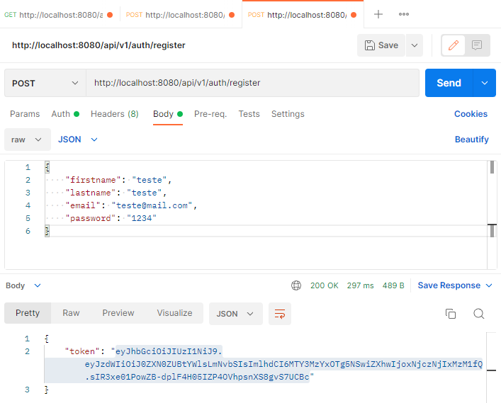
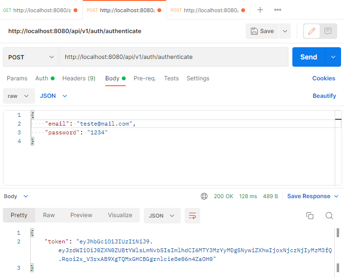
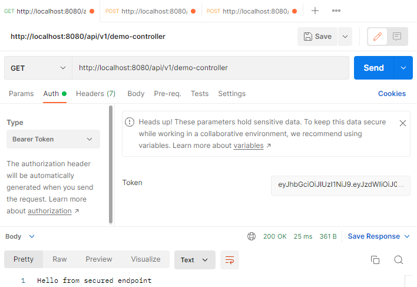
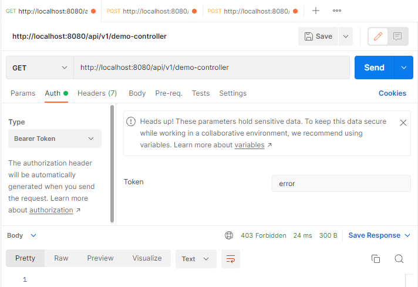

# Security App
## A Java App JWT authentication and authorization in a Spring Boot 3.0 application using Spring Security 6 and a Postgres database to store user credentials

Language: Java 17

Frameworks: Springboot 3 and Spring Security 6

DataBase: PostgreSQL to register users.

use the method `REGISTER` to generate a token to access

the `AUTHENTICATE` method to validate the access and renew the token

if are the correct token, it grants the access to user

if the token are invalid or have something wrong with token, don't return the access 
